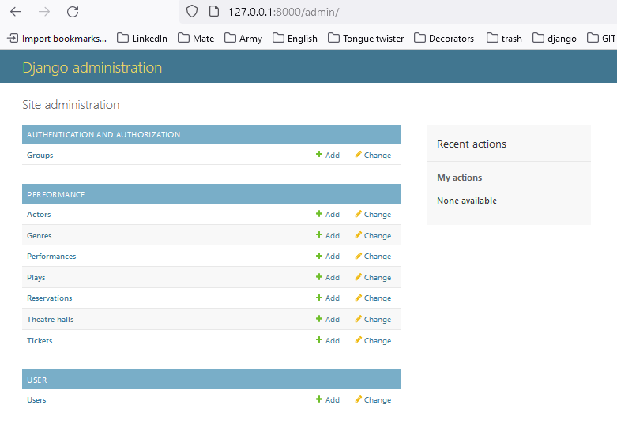
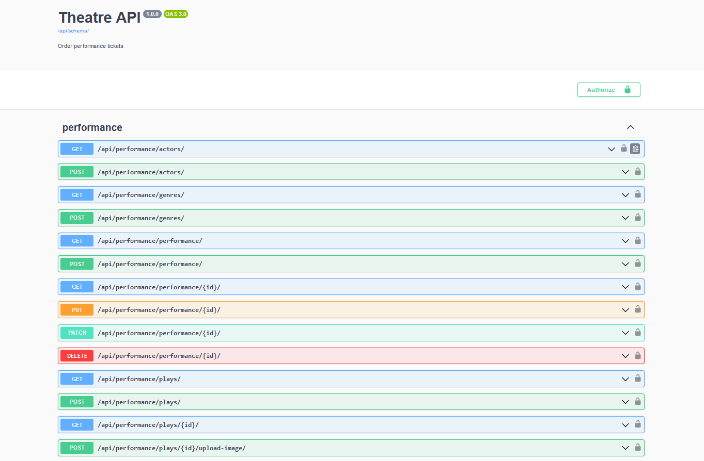

# Theatre API Service

Theatre API Service is a Django-based REST API for managing theatre, plays, performance, and more. It provides endpoints for creating, updating, and retrieving theatre-related data, as well as user registration and tickets management.

## Table of Contents
- [Introduction](#introduction)
- [Feature](#features)
- [Installation](#installation)
- [Credentials](#credentials)
- [API Endpoints](#endpoints)
- [Schema](#schema)
- [Screenshots](#screenshots)

## Introduction

Theatre API Service is designed to streamline the management of Theatre-related data and user interactions.

### Features:
- CRUD operations for actors, genres, performance, plays, and tickets.
- Add images for plays
- Ticket validation based on rows and seats availability.

## Installation

1. Clone the repository:

   ```
   https://github.com/Tarasidze/theatre-api-service
   ```
2. Create .env file and define environmental variables followin .env.example:
   ```
   SECRET_KEY="some_secret_key"
   POSTGRES_DB=some_db
   POSTGRES_DB_PORT=some_port
   POSTGRES_USER=some_user
   POSTGRES_PASSWORD=some_password
   POSTGRES_HOST=some_host
   DEBUG=FALSE
   ```
3. Run command:
   ```
   docker-compose up --build
   ```
4. App will be available at: ```127.0.0.1:8000```

## Credentials
```
   (in develop)
```

## Endpoints
```
       /admin/: Django admin panel interface.
       
   API Endpoints:
       /api/performance/: Performance-related API endpoints.
       /api/user/: User-related API endpoints.
       
   Documentation Endpoints (drf-spectacular):
       /api/schema/: API schema generated by drf-spectacular.
       /api/doc/swagger/: Swagger UI documentation for the API schema.
       /api/doc/redoc/: ReDoc documentation for the API schema.
   
   Debug Toolbar (for debugging purposes):
       /__debug__/: Debug toolbar endpoints.
   
   Genres:
     /genres/: List and create genres.
     /genres/{pk}/: Retrieve, update, and delete a specific genre.
   
   Actors:
     /actors/: List and create actors.
     /actors/{pk}/: Retrieve, update, and delete a specific actor.
   
   Theatre Halls:
     /theatre_halls/: List and create theatre halls.
     /theatre_halls/{pk}/: Retrieve, update, and delete a specific theatre hall.
   
   Plays:
     /plays/: List and create plays.
     /plays/{pk}/: Retrieve, update, and delete a specific play.
   
   Performances:
     /performance/: List and create performances.
     /performance/{pk}/: Retrieve, update, and delete a specific performance.
   
   Reservations:
     /reservation/: List and create reservations.
     /reservation/{pk}/: Retrieve, update, and delete a specific reservation.
```

## Schema
(in develop)

## Screenshots

